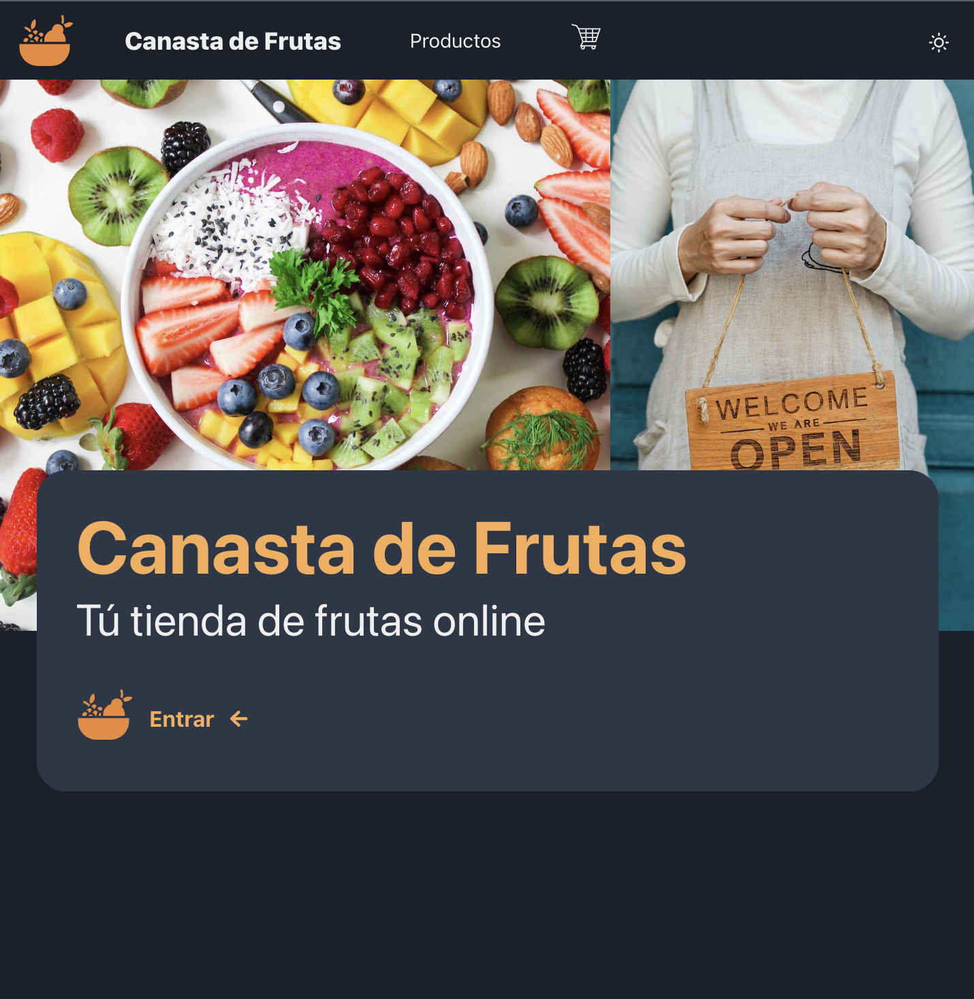
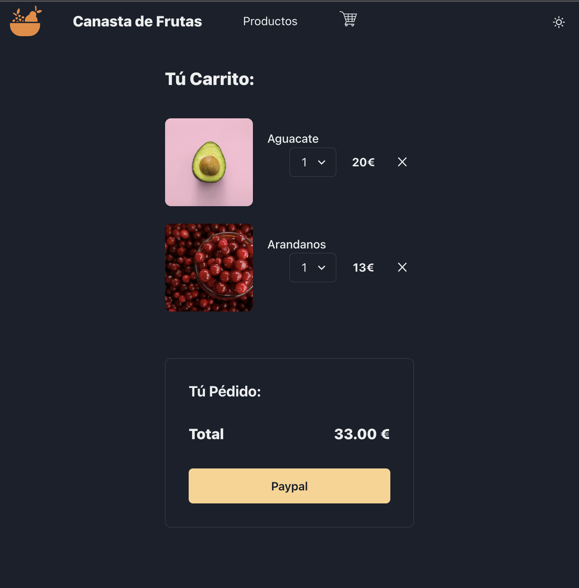

# BIENVENIDOS A LA TU TIENDA DE FRUTAS ONLINE: CANASTA DE FRUTAS Bienvenidos a Canasta de Frutas, la tienda online donde podrás encontrar la mejor selección de frutas frescas y de calidad.




# ¿Quiénes somos? 
En Canasta de Frutas somos un equipo de apasionados por las frutas. Nos encanta seleccionar las mejores frutas de temporada para ofrecerte productos de alta calidad y frescura. Además, nos aseguramos de que nuestras frutas sean cultivadas de manera sostenible y respetuosa con el medio ambiente.

# ¿Qué ofrecemos? 
Ofrecemos una amplia variedad de frutas frescas y de temporada, desde manzanas y peras hasta kiwis y piñas. Además, también ofrecemos una selección de frutas exóticas y tropicales para aquellos que buscan algo diferente.

En Canasta de Frutas también nos preocupamos por la comodidad de nuestros clientes, por lo que ofrecemos la opción de comprar canastas de frutas preseleccionadas o personalizar tu propia canasta de frutas.


#  ¿Cómo comprar? 
Para comprar en Canasta de Frutas, simplemente selecciona los productos que deseas y agrega al carrito de compras. Una vez que hayas agregado todos los productos, procede a la página de pago y completa el proceso de pago. ¡Y listo! En pocos días tendrás tus frutas frescas y de calidad en la puerta de tu casa.




# ¿Cómo contactarnos? 
Si tienes alguna pregunta o comentario sobre nuestros productos, no dudes en contactarnos a través de los issues. Estaremos encantados de atenderte.

¡Gracias por elegir Canasta de Frutas como tu tienda de frutas online!


## API Reference

#### Get all items

```http
  GET /api/products
      http://localhost:5001/api/products

```

#### Get one item

```http
  GET /api/products/:id
        http://localhost:5001/api/products/:id

```
# Instalar dependencias

    npm i

# Iniciar semilla para rellenar bd dentro de la carpeta back

    node seed/seed.js  

# Iniciar servidor dentro de la carpeta back

    npm run server

# Iniciar cliente/React dentro de la carpeta client

    npm start
    http://localhost:3000/


# Arrancar back y front 
    npm run app


